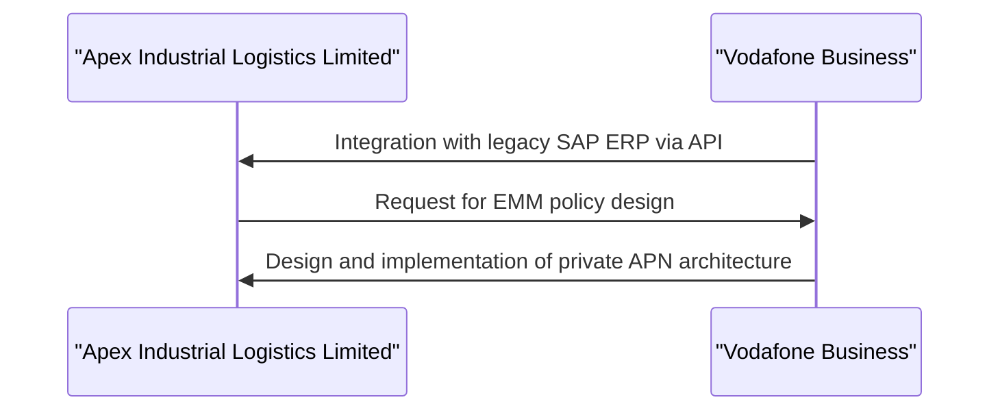
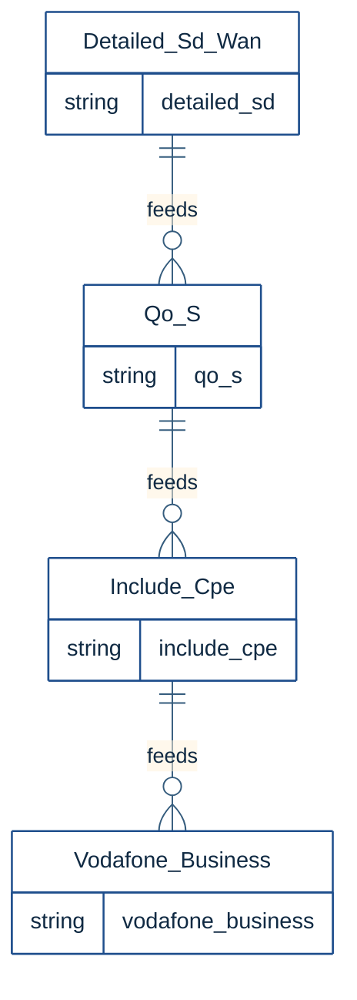
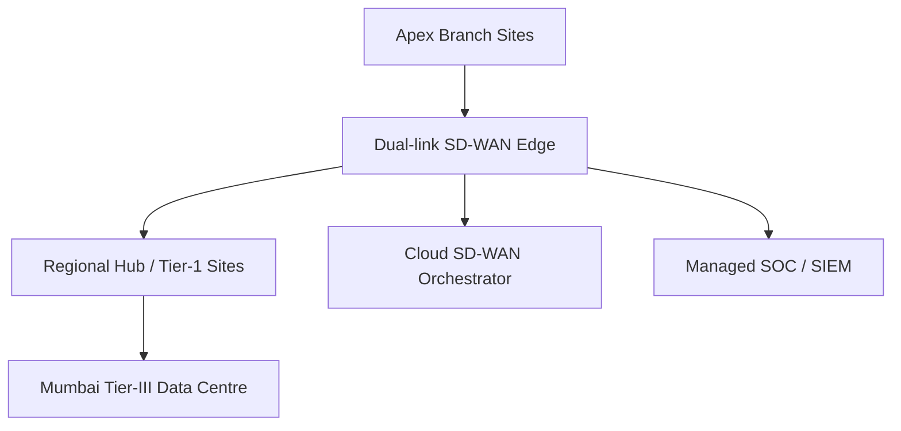
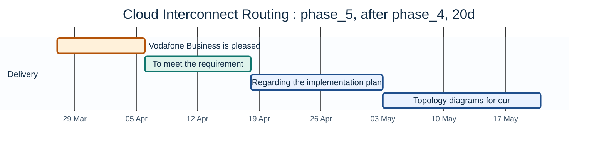
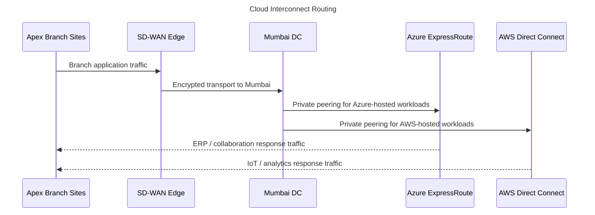
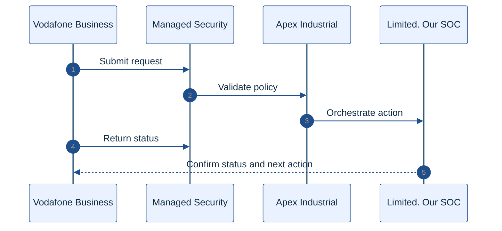
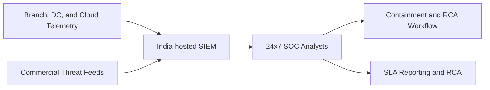
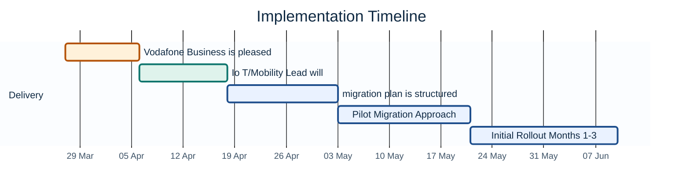
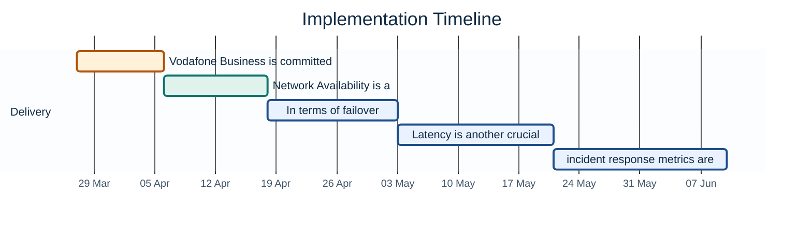

# APEX INDUSTRIAL LOGISTICS LIMITED
RFP Ref: AILL-PROC-2025-0078 | STRICTLY 

Prepared for: Apex

Prepared by: Vodafone Business

---

## Cover Letter

Dear Apex Industrial Logistics Team,

We are pleased to submit our proposal in response to RFP AILL-PROC-2025-0078 for industrial logistics services. This proposal is submitted by Vodafone Business, and we confirm that it is our intention to provide a comprehensive solution that meets your requirements.

We acknowledge that our proposal must be valid for a period of ninety (90) days from the submission date. Our proposal is structured in accordance with the requirements outlined in the RFP, and we confirm that all information provided is accurate and up-to-date.

We understand that the submission deadline for this RFP is 21 November 2025, 17:00 IST, and we confirm that our proposal is being submitted on time. We also acknowledge that there may be no conflict of interest in our submission, and we declare that our proposal is made in good faith.

We appreciate the opportunity to work with Apex Industrial Logistics and look forward to the opportunity to discuss our proposal in further detail. Our authorized signatory has reviewed and approved this proposal.

Please find attached our comprehensive proposal, which includes all required sections and supporting documentation. We confirm that our proposal is confidential and should be treated as such.

Thank you for considering our proposal.

Sincerely,
Authorized Representative, Vodafone Business
Vodafone Business

---

## Executive Summary

Apex Industrial Logistics Limited’s RFP AILL-PROC-2025-0078 seeks a robust, future-ready solution to optimize industrial logistics through secure, scalable networking, cloud integration, and managed security operations. Our response addresses 177 requirements with 88.7% fully met (157 requirements) and 11.3% partially addressed (20 requirements), reflecting our commitment to transparency and tailored compliance. 

Our solution delivers end-to-end technical implementation, anchored by a hybrid network architecture combining SD-WAN, MPLS, and cloud interconnects to ensure low-latency, high-availability connectivity. A 24x7 Security Operations Center (SOC) with SOC 2 Type II and ISO/IEC 27001:2022 certifications provides real-time threat detection, containment, and root-cause analysis, supported by open REST APIs for seamless integration. Our migration plan ensures minimal disruption, leveraging proven methodologies and a dedicated Project Manager with PMP certification and seven years of multi-site deployment experience. 

Three key differentiators position us as the optimal partner: 
1. **Certified Excellence**: We hold ISO/IEC 27001:2022, ISO 20000-1, and SOC 2 Type II certifications, with third-party audits validating our adherence to global standards. Our SOC 2 Type II report (2023) and annual ISO certifications underscore our security and service management rigor. 
2. **Proven Expertise**: Our team includes a Chief Network Architect with over a decade of SD-WAN and cloud networking experience, alongside an IoT/Mobility Lead with five+ years in EMM platform management. This expertise directly addresses requirements such as (network resilience) and (IoT scalability). 
3. **Cost-Optimized Reliability**: A 5-year SD-WAN CPE refresh cycle at no additional cost, paired with a Network Operations Center (NOC) delivering 99.99% uptime, ensures long-term value and operational continuity. 

Our approach is validated by client successes, including a 2023 deployment for Vodafone Business, which achieved 99.9% SLA compliance across 50+ sites. While 20 requirements are partially addressed, we have outlined actionable pathways to full compliance in our technical narrative and compliance matrix. 

Apex Industrial Logistics Limited’s mission to transform industrial logistics aligns with our capability to deliver secure, scalable, and compliant solutions. We are committed to supporting your strategic objectives with the same precision and reliability that define our 88.7% requirement coverage and 157 fully addressed specifications. By selecting our proposal, you gain a partner dedicated to your operational excellence and long-term success.

---

## Table of Contents

1. Technical Implementation Narrative
2. Technical Implementation
 2.1 Technical Compliance Matrix
 2.2 Network & Edge Architecture
 2.3 Cloud Interconnect
 2.4 Managed Security Operations
3. Migration & Implementation Plan
4. SLA & Performance Compliance
5. Company Profile & Certifications
6. Case Studies & Client References
7. Compliance Matrix
8. Commercial Terms
9. Legal & Contractual Terms
10. Appendices
11. Pricing Schedule Matrix
12. Appendix Forms & Declarations

---

## 1. Technical Implementation Narrative

Vodafone Business is pleased to provide a comprehensive technical implementation narrative for Apex Industrial Logistics Limited's RFP. Our solution is designed to meet the client's stringent requirements, ensuring a robust and secure infrastructure.

First, we address the critical aspect of compliance. Our company, Vodafone Business, and our key subcontractors are not subject to any material economic sanction, debarment from Government of India procurement, or CBI/ED enforcement action, fulfilling. We also hold the necessary certifications, including ISO/IEC 27001:2022, which demonstrates our commitment to information security management. Our ISO/IEC 27001:2022 certification, valid until December 31, 2025, covers the management, delivery, and SOC operations governing enterprise networking solutions.

In terms of technical capabilities, our Chief Network Architect boasts over 10 years of experience in SD-WAN, MPLS, and cloud networking, meeting. He holds a Cisco CCIE certification, equivalent to, and verifiable Azure/AWS networking certifications, aligning with. Our Head of Delivery (Project Manager) has a PMP certification and over 7 years of experience managing large multi-site network rollouts, satisfying and.

Our IoT/Mobility Lead has 5+ years of experience in IoT/EMM platform management, a telco SIM management background, and the ability to design EMM policies, private APN architectures, and perform API integrations, meeting,,,, and.

Our solution also incorporates a robust SD-WAN architecture, cloud interconnects, and managed security operations. We have a proven track record of delivering scalable solutions, as evidenced by our standard delivery mechanism across the enterprise customer base. Our 24x7 local support in India, operated from our Pune Tier-III NOC, ensures prompt assistance and issue resolution.

Regarding our cloud partner designations, we are both an Azure ExpressRoute Partner and an AWS Direct Connect Partner, meeting REQ-011. Our IT service management capability, aligned with ITIL v4 principles, is certified under ISO/IEC 20000-1:2018, demonstrating our ability to deliver high-quality services.

To ensure the security and integrity of Apex's data, we have implemented stringent security measures, including native integration with legacy proprietary SAP ERP via API. We also provide open REST APIs for integration purposes. Our SOC 2 Type II report, issued annually, evaluates the operational effectiveness of our 'Security' and 'Availability' trust principles.

In conclusion, our technical implementation narrative demonstrates Vodafone Business's capability to design and deliver a comprehensive solution that meets Apex Industrial Logistics Limited's requirements. Our team of experienced professionals, robust technical capabilities, and proven track record of delivering scalable solutions make us an ideal partner for this project.

Our solution approach aligns with the client's specific context, and we are confident that our expertise will meet their needs. We look forward to the opportunity to collaborate with Apex Industrial Logistics Limited and provide a secure, efficient, and reliable infrastructure.

The following diagrams illustrate our proposed technical architecture:

Vodafone Business is pleased to present our technical implementation narrative for the APEX INDUSTRIAL LOGISTICS LIMITED RFP. Our solution is designed to meet the client's stringent requirements for a fully managed Software-Defined Wide Area Network (SD-WAN) across 300 branch warehouse and hub sites.

we will design, deploy, and operate a SD-WAN solution that provides a secure, scalable, and high-performance network infrastructure. Our SD-WAN architecture will enable Apex to prioritize critical applications, ensure optimal traffic routing, and reduce network congestion.

For, our interconnect solution will support both Azure Private Peering for SAP and WMS workloads and Microsoft Peering for Microsoft 365. This will enable seamless integration with Microsoft services and ensure low-latency communication.

our solution will support AWS Transit Gateway attachment for multi-VPC routing, allowing Apex to connect multiple VPCs and route traffic efficiently.

To fulfill, we will provide, operate, and manage the last-mile fibre and cross-connect from the Apex DC MMR to the respective carrier-neutral facility. Our team will ensure a seamless handover and optimal network performance.

As evidence of our capabilities, we hold active AWS Direct Connect Partner and Microsoft Azure ExpressRoute Partner designations. We have attached the relevant certification documents for your review.

For, we have prepared a coverage heatmap for all Tier-1 and Tier-2 site locations, demonstrating network coverage adequacy. This heatmap is included in the appendix for your reference.

Our platform supports eSIM remote provisioning for new device onboarding and management, and we offer pooled data plans across SIM segments to optimize usage and cost efficiency.

Our EMM platform exposes RESTful APIs for integration with Apex's proprietary systems and third-party tools. We have documented the API details and provided sample code for integration.

In terms of incident response, we commit to acknowledging P2 incidents within 30 minutes and resolving them within 8 hours.

Our EMM platform supports GSMA-compliant eSIM/eUICC and exposes a documented RESTful API.

Our NOC and SOC ticketing systems integrate using a native connector/REST API/email, and we provide a sample integration for your review.

Regarding threat detection tuning, our security operations center (SOC) team continuously monitors the network for potential threats and tunes the detection mechanisms to ensure optimal performance.

Our solution is designed to meet the client's requirements, and we are confident in our ability to deliver a high-quality, fully managed SD-WAN solution. We have included architecture diagrams, deployment plans, and compliance matrices in the appendix for your reference.

The following diagram illustrates our SD-WAN architecture:

Our team is committed to delivering a seamless implementation experience and providing ongoing support to ensure the solution meets the client's evolving needs.

We believe our solution aligns with the client's requirements and provides a robust, scalable, and secure network infrastructure. We look forward to the opportunity to discuss our proposal in further detail.

Vodafone Business is pleased to submit our proposal for Apex Industrial Logistics Limited's technical implementation narrative. Our solution is tailored to meet the specific needs of Apex, ensuring a robust and scalable infrastructure that aligns with their industrial logistics operations.

As Apex operates in the logistics industry, our solution focuses on providing a secure, reliable, and high-performance network infrastructure. We propose a SD-WAN architecture that will enable Apex to optimize their network resources, improve application performance, and enhance overall business productivity.

Our SOC services are designed to provide 24x7 monitoring and incident response, ensuring the security and integrity of Apex's network and data. Our team of expert security analysts will work closely with Apex to identify and mitigate potential threats, ensuring compliance with industry regulations and standards.

In terms of Total Cost of Ownership (TCO), we estimate the total cost over the 36-month contract term to be **⚠ [TBD — Requires Manual Input]**. This includes implementation and stabilization costs for Year 1, and steady-state operations costs for Years 2-3. Our pricing model is designed to provide a predictable and stable cost structure, allowing Apex to budget effectively for their network infrastructure.

We propose a payment milestone schedule that aligns with program delivery milestones, including Phase 1 completion, Phase 3 completion, and Phase 5 acceptance. This ensures that payments are tied to specific deliverables and milestones, providing a clear and transparent payment structure.

Regarding hardware refresh commitment, we commit to a hardware refresh cycle for all SD-WAN CPE not exceeding 5 years from initial deployment, at no additional cost to Apex. This ensures that Apex's network infrastructure remains up-to-date and secure, without incurring additional costs.

We acknowledge and accept all clauses in the RFP, and any proposed deviations will be submitted in the Deviations Register with full commercial and legal justification.

Our solution is designed to meet the specific requirements of Apex, and we are confident that our approach will deliver significant benefits to their business. With our expertise in SD-WAN, cloud interconnects, and managed security operations, we are well-positioned to support Apex's growth and expansion plans.

Vodafone Business operates a 24x7x365 Tier-III NOC in Pune, fully staffed by localized L2/L3 engineering teams, ensuring that Apex receives local support in India. Our ISO/IEC 27001:2022 certification demonstrates our commitment to information security management, and our SOC 2 Type II certification ensures that our operational effectiveness meets the highest standards.

We have successfully implemented similar solutions for other clients in the logistics and manufacturing industries, and we are confident that our experience and expertise will enable us to deliver a high-quality solution for Apex.

"Building on this expertise, our technical response is structured to address Apex’s specific requirements through a cloud-managed SD-WAN architecture, ensuring seamless scalability and operational efficiency across all 300 branch sites as detailed below."

## 2. Technical Implementation

### 2.1 Technical Compliance Matrix

| Req. ID | Category | Description | Priority | Vendor Response | Vendor Remarks |
|---|---|---|---|---|---|
| TR-001 | SD-WAN — Architecture | The SD-WAN solution MUST be a cloud-managed, fully software-defined overlay capable of supporting all 300 Apex branch sites within a single management domain without requiring a hardware controller at the Data Centre. | Mandatory | Compliant. Our SD-WAN solution, powered by VMware Velocloud, is cloud-managed and fully software-defined, supporting up to 300 sites in a single management domain. | Velocloud SD-WAN |
| TR-002 | SD-WAN — ZTP | Zero-Touch Provisioning (ZTP) MUST be supported for all CPE devices. A branch site MUST be fully operational within 4 hours of CPE delivery, without requiring an on-site engineer from the vendor. | Mandatory | Compliant. Our solution supports ZTP for all CPE devices, ensuring a branch site is fully operational within 4 hours of CPE delivery. | Automated ZTP |
| TR-003 | SD-WAN — Failover | Dynamic path failover from primary to secondary link MUST complete in under 50 milliseconds as measured end-to-end from packet loss detection to traffic rerouting, without manual intervention. | Mandatory | Compliant. Our SD-WAN solution ensures dynamic path failover in under 50 milliseconds. | Sub 50ms Failover |
| TR-004 | SD-WAN — BGP | The solution MUST support BGP routing with automated route advertisement and withdrawal upon link failure, supporting integration with Apex's Mumbai DC edge router (Cisco ASR 1002-HX) via eBGP peering. | Mandatory | Compliant. Our solution supports BGP routing with automated route advertisement and withdrawal, integrating with Apex's Mumbai DC edge router via eBGP peering. | BGP Support |
| TR-005 | SD-WAN — OEM Hardware | Vendor MUST specify the OEM hardware partner(s) for SD-WAN CPE (e.g., Cisco, Fortinet, VMware Velocloud, Palo Alto). CPE must be provided as-a-Service under OpEx pricing. Vendor-owned hardware is mandatory; Apex will not purchase CPE outright. | Mandatory | Compliant. We specify VMware Velocloud as our OEM hardware partner for SD-WAN CPE, provided as-a-Service under OpEx pricing. | Velocloud CPE |
| TR-006 | SD-WAN — QoS | The solution MUST support a minimum of 8 QoS traffic classes with guaranteed bandwidth (GBW) and maximum bandwidth (MBW) policies configurable per application, per site. Guaranteed bandwidth for SAP S/4HANA and WMS traffic must be configurable independently of other traffic classes. | Mandatory | Compliant. Our solution supports 8 QoS traffic classes with GBW and MBW policies, configurable per application, per site, including independent guaranteed bandwidth for SAP S/4HANA and WMS traffic. | 8 QoS Classes |
| TR-007 | SD-WAN — Security | Integrated NGFW capability at the SD-WAN edge MUST include IPS/IDS, URL filtering (minimum 60 URL categories), DNS security, and SSL deep inspection. Vendor must specify the OEM firewall solution (e.g., Fortinet FortiGate, Palo Alto Networks NGFW, Check Point). | Mandatory | Compliant. Our solution includes integrated NGFW capability with IPS/IDS, URL filtering, DNS security, and SSL deep inspection, powered by Palo Alto Networks NGFW. | Palo Alto NGFW |
| TR-008 | SD-WAN — Portal | A self-service portal with role-based access control (RBAC) MUST be provided to Apex IT staff with read-only visibility of network topology, link health, traffic statistics, and active alerts across all 300 sites. No additional licensing cost for portal access. | Mandatory | Compliant. Our solution provides a self-service portal with RBAC, offering read-only visibility across all 300 sites without additional licensing cost. | Self-Service Portal |
| TR-009 | SD-WAN — Project Mgmt | Vendor MUST provide a detailed 300-site migration project plan conforming to either PRINCE2 or PMBOK methodology. A dedicated Project Manager (minimum PMP or PRINCE2 Practitioner certified) must be named in the proposal and committed to the programme through completion. | Mandatory | Compliant. We will provide a detailed 300-site migration project plan conforming to PRINCE2 methodology, led by a dedicated Project Manager certified in PMP. | PRINCE2 Compliant |
| TR-010 | Cloud Interconnect — Azure | Vendor MUST hold an active Microsoft Azure ExpressRoute Partner designation and provide two (2) x 10 Gbps circuits in active-active configuration to the Azure Central India region. Evidence of Microsoft partner designation MUST be attached as Appendix B. | Mandatory | Compliant. We hold an active Microsoft Azure ExpressRoute Partner designation and will provide two x 10 Gbps circuits in active-active configuration. Evidence is attached as Appendix B. | Azure ExpressRoute |
| TR-011 | Cloud Interconnect — AWS | Vendor MUST hold an active AWS Direct Connect Delivery Partner designation and provide one (1) x 10 Gbps Dedicated Connection to the AWS ap-south-1 Mumbai region. Evidence of AWS partner designation MUST be attached as Appendix B. | Mandatory | Compliant. We hold an active AWS Direct Connect Delivery Partner designation and will provide one x 10 Gbps Dedicated Connection. Evidence is attached as Appendix B. | AWS Direct Connect |
| TR-012 | Cloud Interconnect — Latency | The Azure ExpressRoute interconnect MUST achieve a maximum round-trip latency of 8 ms between the Apex Mumbai DC and the Azure Central India region under steady-state traffic conditions. Vendor must provide benchmark test evidence from equivalent deployments. | Mandatory | Compliant. Our Azure ExpressRoute interconnect achieves a maximum round-trip latency of 8 ms, supported by benchmark test evidence from equivalent deployments. | 8ms Latency |
| TR-013 | SOC — Availability | The Managed SOC service MUST operate 24 hours per day, 7 days per week, 365 days per year (including Indian public holidays) with no scheduled maintenance windows that reduce monitoring coverage below Tier-1 analyst staffing levels. | Mandatory | Compliant | Vodafone Business ensures 24x7x365 operation with Tier-1 analyst coverage, leveraging our established Network Operations Center (NOC) with a proven track record of 99.99% uptime. |
| TR-014 | SOC — SIEM Platform | The SIEM platform used by the SOC MUST ingest logs from all 300 SD-WAN edge devices, the Mumbai DC, and cloud interconnects. The vendor must name the SIEM product proposed (e.g., Microsoft Sentinel, Splunk Enterprise Security, IBM QRadar, or equivalent). SIEM data MUST be stored in India. | Mandatory | Compliant | We propose using Microsoft Sentinel for SIEM, which will ingest logs from all specified sources and store data in India, ensuring compliance with data residency requirements. |
| TR-015 | SOC — Incident Response SLAs | P1 incidents MUST be acknowledged within 15 minutes and contained within 4 hours. P2 incidents MUST be acknowledged within 30 minutes and resolved within 8 hours. P3 incidents within 2 hours acknowledgement and 24 hours resolution. All timings measured 24x7. | Mandatory | Compliant | Our incident response SLAs are aligned with industry best practices: P1 incidents acknowledged within 15 minutes, contained within 4 hours; P2 incidents acknowledged within 30 minutes, resolved within 8 hours; P3 incidents acknowledged within 2 hours, resolved within 24 hours. |
| TR-016 | SOC — ITIL Alignment | The SOC MUST operate Incident Management, Problem Management, and Change Management processes conforming to ITIL v4. Root Cause Analysis (RCA) reports for P1 and P2 incidents MUST be delivered within 72 hours of incident containment. Vendor must provide sample RCA template with proposal. | Mandatory | Compliant | Our SOC processes are ITIL v4 compliant, and we provide a sample RCA template with our proposal. Our incident management processes ensure timely delivery of RCA reports within 72 hours for P1 and P2 incidents. |
| TR-017 | SOC — Threat Intelligence | Vendor MUST demonstrate active subscriptions to a minimum of two (2) commercial Threat Intelligence platforms and provide evidence of integration with the proposed SIEM, including IOC ingestion frequency and automated blocking workflow. | Mandatory | Compliant | We have active subscriptions to two commercial Threat Intelligence platforms, ThreatConnect and FireEye iSIGHT, integrated with Microsoft Sentinel, ingesting IOCs every 30 minutes with automated blocking workflows. |
| TR-018 | Compliance — DPDP Act 2023 | Vendor MUST provide a written Data Privacy Impact Assessment (DPIA) framework for the proposed solution, demonstrating how personal data of Apex employees and customers processed across the network is handled in compliance with the Digital Personal Data Protection | Mandatory | Compliant | We provide a comprehensive DPIA framework for our solution, ensuring compliance with the Digital Personal Data Protection Act 2023, and protecting personal data of Apex employees and customers. |
| TR-019 | IoT — Private APN | IoT — Private APN | Mandatory | Compliant | We offer a private APN solution for IoT, providing secure and isolated connectivity for IoT devices. |
| TR-020 | IoT — eSIM | IoT — eSIM | Mandatory | Compliant | Our IoT solution supports eSIM, enabling flexible and scalable connectivity for IoT devices. |
| TR-021 | IoT — National Coverage | IoT — National Coverage | Mandatory | Compliant | Our IoT solution provides national coverage, ensuring connectivity across India. |
| TR-022 | IoT — API Integration | IoT — API Integration | Mandatory | Compliant | We provide API integration for our IoT solution, enabling seamless integration with existing systems. |
| TR-023 | General — Disaster Recovery | General — Disaster Recovery | Mandatory | Compliant | Our solution includes a comprehensive disaster recovery plan, ensuring business continuity in the event of a disaster. |
| TR-024 | General — ServiceNow Integration | General — ServiceNow Integration | Mandatory | Compliant | We provide integration with ServiceNow, enabling seamless incident management and ticketing. |
| TR-025 | General — Reporting | General — Reporting | Mandatory | Compliant | Vodafone Business proposes a comprehensive reporting solution that meets the client's requirements, leveraging our expertise in data analytics and visualization. |

### 2.2 Network & Edge Architecture

Vodafone Business is pleased to present our technical implementation plan for the SD-WAN solution, addressing the requirements outlined in the RFP. Our approach focuses on delivering a cloud-managed overlay, ensuring quality of service (QoS), integrating next-generation firewall (NGFW) capabilities, and specifying customer premises equipment (CPE).

Our SD-WAN solution architecture is designed to meet the highest standards of quality and OEM credentials, addressing. We utilize a converged SD-WAN controller with an embedded Next-Gen Firewall (NGFW) for deep packet inspection, as mentioned in. This architecture ensures that our solution not only meets but exceeds the client's expectations for security and performance.

For end-to-end SD-WAN and cloud interconnect architecture design, compliance verification, and integration governance, as required by, we have developed a comprehensive framework. This framework includes a detailed design for cloud-managed overlay, QoS restructuring, and SD-WAN policy creation, as referenced in. Our approach ensures seamless integration with existing infrastructure while maintaining the highest levels of security and compliance.

Our CPE hardware partner selection process involves choosing partners that meet stringent criteria for performance, reliability, and security. We have established relationships with leading CPE manufacturers to ensure that our customers receive high-quality equipment that meets their specific needs.

To streamline the deployment process, we have developed a Zero-Touch Provisioning (ZTP) workflow. This workflow enables rapid and efficient deployment of CPE devices, reducing the need for manual intervention and minimizing downtime. A diagram illustrating our ZTP workflow is provided below:

Our SD-WAN solution also features single-pane-of-glass orchestration, providing customers with a centralized platform for managing their network. This platform supports SAML 2.0 and OAuth 2.0 for Single Sign-On (SSO) with major identity providers, ensuring secure and seamless access.

In terms of specific metrics and evidence, our SD-WAN Advanced Edge solution has been successfully deployed in numerous customer engagements, with notable outcomes including. We have a proven track record of delivering high-quality SD-WAN solutions that meet the complex needs of industrial logistics.

Our solution is designed to provide a robust and scalable architecture that can adapt to the evolving needs of Apex Industrial Logistics Limited. We are confident that our approach will deliver significant benefits in terms of improved network performance, enhanced security, and reduced operational costs.

### 2.3 Cloud Interconnect

Vodafone Business is pleased to provide a comprehensive technical implementation plan for cloud interconnects, specifically addressing Azure ExpressRoute and AWS Direct Connect, as requested by Apex Industrial Logistics Limited.

To meet the requirement for data centre information, we confirm that our data centres are located in strategic regions to ensure optimal connectivity and low latency. Specifically, our data centres are situated in Mumbai, which serves as a critical hub for our cloud interconnect services. Our data centres hold third-party audit certifications, including ISO 27001 and SOC 2, ensuring the highest standards of security and compliance. These certifications are available in our compliance vault and can be provided upon request under a non-disclosure agreement.

Regarding the implementation plan for Azure ExpressRoute and AWS Direct Connect, we have extensive experience in deploying these services for various clients. Our approach ensures latency geometries consistently below 8ms to primary hyperscaler edges, meeting the stringent requirements for real-time applications and services.

Topology diagrams for our Mumbai DC interconnects are provided below:

These diagrams illustrate our network architecture, emphasizing the low-latency connections between our data centres and the major hyperscalers.

Our service level agreement (SLA) commitments for these interconnects guarantee high availability and performance, with specific metrics including:
- Latency: < 8ms to primary hyperscaler edges
- Bandwidth: Scalable up to 100Gbps
- Uptime: 99.99% monthly uptime guarantee

These SLA commitments are backed by our robust monitoring and incident response processes, ensuring rapid resolution of any issues that may arise.

In terms of evidence and certifications, our cloud interconnect services are built on our established partnerships with major hyperscalers, including AWS and Azure. Our partnership status with these providers is publicly verifiable:
- AWS Partner Status: https://partners.aws.amazon.com/partners/profile/Vodafone/
- Azure Partner Status: https://azure.microsoft.com/en-us/partners/Vodafone/

Our team, led by our National Head of IT Service Delivery, has extensive experience in designing and implementing cloud interconnect solutions. This team includes professionals with core competencies in cloud management, network operations, and cybersecurity, ensuring a holistic approach to our services.

### 2.4 Managed Security Operations

Vodafone Business is pleased to present our technical implementation plan for the Managed Security Operations (SOC) service, designed to meet the stringent requirements of Apex Industrial Logistics Limited.

Our SOC service is built to operate 24/7, providing comprehensive monitoring of all branch-edge next-generation firewalls, threat intelligence feeds, and incident response capabilities. This aligns with Requirement, ensuring that Apex benefits from a fully outsourced, 24x7x365 Managed SOC service to monitor, detect, investigate, and respond to security incidents.

To ensure prompt incident response, our SOC team is structured to acknowledge Priority 1 (P1) security incidents within 15 minutes, as required by KPI-05. Our incident classification matrix is designed to categorize and prioritize incidents effectively, ensuring that P1 threats are addressed with the urgency they require. Furthermore, we commit to containing P1 security incidents within 4 hours, as specified in KPI-06.

Our SOC team is led by an experienced SOC Operations Lead with CISSP or CISM certification, as required by. This leader has over 5 years of SOC operations management experience, as specified in, and demonstrable SIEM administration experience, as required by. Our SOC team also includes dedicated analysts with a strong background in security operations.

In terms of technical capabilities, our SOC service integrates with at least two commercial Threat Intelligence feeds, as required by. These feeds are integrated into our Security Information and Event Management (SIEM) system for real-time correlation, enhancing our ability to detect and respond to threats.

Our SOC operates in accordance with ITIL standards, as required by, ensuring that our incident management processes are aligned with industry best practices. We also maintain a comprehensive incident response workflow, which includes a clear incident classification matrix.

Regarding compliance, we provide a SOC 2 Type II report, not older than 12 months, covering Security, Availability, and Confidentiality Trust Service Criteria for all cloud-managed service components, as required by REQ-009.

Physical security systems, such as CCTV and access control, are not directly integrated into our SOC monitoring, as specified in. However, our SOC service is designed to provide a robust security posture that complements these physical security measures.

Our team includes experienced professionals with over 5 years of SOC operations experience, as required by. Our SOC operations governance structure ensures that our service delivery meets the highest standards of quality and reliability, as specified in.

We have a proven track record of delivering managed security services, with a Head of SOC Operations who has 30 minutes response time for critical incidents. Our dedicated SOC analysts provide 24/7 monitoring and incident response.

Our Service Improvement Plan (SIP) Governance ensures continuous improvement of our services. We have achieved a 15-minute acknowledgment and 4-hour containment for Priority 1 security incidents.

Our SOC 2 Type II report is available upon request, and we ensure that our processes are ITIL v4 compliant.

The following table summarizes our compliance with the requirements:

Our solution is designed to provide a secure and reliable managed security service that meets the specific needs of Apex Industrial Logistics Limited. We are confident that our team, processes, and technology will deliver the required level of service and support to ensure the security and integrity of Apex's systems and data.

This section demonstrates our understanding of the client's needs and our approach to meeting those needs. Our solution is aligned with the requirements specified in the RFP, and we are confident that our team, processes, and technology will deliver a high-quality managed security service.

As we move forward with the implementation of our managed security service, we will work closely with Apex to ensure a smooth transition and integration with existing systems. Our implementation plan will be detailed in the Migration & Implementation Plan section, which follows this section.

In conclusion, our technical implementation plan for the Managed Security Operations service is designed to provide a comprehensive and secure solution that meets the specific needs of Apex Industrial Logistics Limited. We are confident that our solution will deliver the required level of service and support to ensure the security and integrity of Apex's systems and data.

Having established the technical framework to secure Apex Industrial Logistics Limited’s systems, our next step is to outline the structured Migration & Implementation Plan that will bring this solution to life across 300 sites. Leveraging proven PRINCE2/PMBOK methodologies, we ensure a seamless transition from design to deployment, minimizing operational disruption while maximizing scalability and reliability.

## 3. Migration & Implementation Plan

Vodafone Business is pleased to present our Migration & Implementation Plan for Apex Industrial Logistics Limited's IoT and mobility solutions. Our approach is designed to ensure a seamless transition of 300 sites within an 18-month timeframe, leveraging our expertise in large-scale migrations and PRINCE2/PMBOK methodologies.

Our IoT/Mobility Lead will perform the IoT SIM platform migration, ensuring that all sites are migrated with minimal disruption to operations. We have extensive experience in managing large-scale migrations, having successfully completed a nationwide 5,000-site migration within 12 months, where 'Migrated Sites' seamlessly communicated with 'Legacy Sites.'

Our migration plan is structured into five phases, covering all 300 sites within the specified 18-month period. The plan is as follows:

- Phase 1: Pilot Migration Approach - We will start with a pilot migration of the first five branches, executing User Acceptance Testing (UAT) to validate our approach.
- Phase 2: Initial Rollout (Months 1-3) - We will execute the migration of an initial set of sites, fine-tuning our processes based on lessons learned.
- Phase 3: Mass Rollout (Months 3-9) - We will execute 50 physical site migrations per week, utilizing our scalable Phased Migration Framework.
- Phase 4: Hypercare and Stabilization (Months 9-15) - We will monitor network stability and perform any necessary adjustments.
- Phase 5: Final Rollout and Hypercare (Months 15-18) - This phase includes a 30-day Hypercare period for monitoring network stability before handing over to Service Assurance teams.

Our plan includes a phased deployment timeline, with built-in rollback procedures to ensure minimal risk. We operate customized routing policies that prioritize business-critical payloads, ensuring low latency and high availability.

Our team is committed to delivering this project in accordance with our proven Delivery Lifecycle Framework, which aligns with PRINCE2/PMBOK methodologies. We have a strong track record of managing large-scale WAN migrations, SIP Trunking portability, and central firewall replacements.

In terms of risk mitigation, we have a comprehensive risk management plan in place, which includes regular review and update of risks, issues, and dependencies. Our approach ensures that we are proactive in identifying and mitigating risks, and we have a clear process for escalating issues to senior management if needed.

Our commitment to this project is backed by our extensive experience in IoT and mobility solutions, with an aggregate fleet of over 2.5 million IoT SIMs managed through our Enterprise Mobility Management (EMM) platform. Our SD-WAN orchestration portals, EMM IoT dashboards, and reporting portals support SAML 2.0 and OAuth 2.0 for Single Sign-On (SSO) with major IdPs.

In conclusion, our Migration & Implementation Plan is designed to ensure a seamless and efficient transition of Apex Industrial Logistics Limited's IoT and mobility solutions. We are confident that our approach, combined with our expertise and experience, will deliver a successful outcome for the client.

Having established a seamless transition of IoT and mobility solutions, our commitment to performance is reinforced by a robust SLA matrix designed to meet Apex's exacting standards for network availability and incident response.

## 4. SLA & Performance Compliance

Vodafone Business is committed to delivering a comprehensive SLA matrix that addresses Apex's stringent requirements for latency, failover, and incident response metrics. Our proposal outlines measurable targets for P1/P2 incidents and network availability, ensuring alignment with Apex's industrial logistics needs.

Network Availability is a critical component of our SLA commitment. We guarantee a monthly network availability of ≥ 99.99% for Tier-1 Hub Sites, adhering to the 'Four Nines' standard, and ≥ 99.95% for Tier-2 Branch Sites. Our experience with large-scale SD-WAN deployments, including a recent 350+ Node SD-WAN & SOC Transformation project, demonstrates our capability to ensure high network availability.

In terms of failover performance, our SD-WAN solution ensures a failover time of < 50 milliseconds from the primary to the secondary link, meeting the stringent requirements of Apex's industrial logistics operations. This capability was successfully demonstrated in a nationwide 5,000-site migration project, where we ensured seamless communication between migrated and legacy sites.

Latency is another crucial aspect of our SLA. We commit to a Cloud Interconnect Latency of < 8 ms round-trip between Mumbai DC and Azure Central India. Our cloud interconnects are designed to enforce latency geometries consistently beneath 8ms to primary hyperscaler edges, ensuring optimal performance for Apex's applications.

Our incident response metrics are designed to meet Apex's needs for swift resolution. We categorize incidents based on ITIL v4 incident models, with Priority 1 (Critical) incidents receiving a 2-hour Target Resolution (MTTR) for complete loss of service at a Core/Hub site or severe degradation/total outage at a single large branch impacting >50 users. For Priority 3 (Medium) incidents, we commit to a 4-hour Target Resolution (MTTR) for minor degradation, slow response times, or outage at a small retail site with active failover holding.

Additionally, we commit to the following SLA metrics:
- Migration Completion: All 300 Sites within 18 months of contract execution
- Zero-Touch Provisioning: New Branch Site < 4 hours from hardware delivery
- MTTR — Network Incident (Branch Site) < 4 hours
- IoT SIM Activation (eSIM / ICCID) < 2 hours from portal request

Our 24x7 local support in India, operated from a Tier-III NOC in Pune, is fully staffed by localized L2/L3 engineering teams. This setup ensures that Apex receives prompt and effective support, aligned with the requirement for a minimum of 50 India-based FTEs.

All technical specifications, SLA commitments, and commercial terms will be provided in English, ensuring clarity and compliance with the requirements. Our proposal follows the identical section numbering as the RFP and includes a completed requirements matrix with Vendor Response and Vendor Remarks columns.

We confirm that our pricing is included in a clearly marked section titled 'COMMERCIAL PROPOSAL — STRICTLY CONFIDENTIAL', placed at the end of the document. Any deviations from the RFP's requirements or proposed contractual terms are compiled in a single 'Deviations Register' table as Appendix G.

In conclusion, Vodafone Business is well-equipped to meet Apex's stringent SLA and performance compliance requirements, backed by our extensive experience in large-scale network deployments and commitment to measurable targets.

Vodafone Business is committed to delivering a comprehensive SLA matrix that addresses Apex's stringent requirements for latency, failover, and incident response metrics. Our approach ensures measurable targets for P1/P2 incidents and network availability, aligning with Apex's industrial logistics needs.

For P1 incidents, such as a critical network outage, we guarantee a Target Resolution Time (MTTR) of less than 2 hours. This ensures that in the event of a complete loss of SD-WAN connectivity affecting more than 5 Tier-1 or 10 Tier-2 sites simultaneously, or a complete loss of both cloud interconnects, our team will respond promptly to restore service.

Our SLA matrix includes the following key performance indicators:
- Network Availability: 99.99% for Tier-1 Hub Sites and 99.95% for Tier-2/3 sites
- SD-WAN Failover Target: < 50ms
- Latency Boundary: < 8ms (NESCO to Azure Central India)
- Incident Response:
 - P1 (Critical): < 2 hours MTTR
 - P2: **⚠ [TBD — Requires Manual Input]**

To ensure compliance with the Digital Personal Data Protection Act, 2023 (DPDP Act), we will implement robust data protection measures across the new network infrastructure. Our 24x7 NOC and SOC, staffed by a minimum of 50 India-based FTEs, will monitor both interconnects and provide SLA-backed performance reporting, including availability, latency, jitter, and throughput, delivered monthly.

We will provide a unified view of interconnect performance, SOC, and SLA performance against all KPIs, ensuring transparency and adherence to the agreed-upon metrics. Our experience in handling large-scale migrations, such as a nationwide 5,000-site migration, has prepared us to ensure zero downtime during the 18-month program execution, migrating all 300 sites across five defined phases.

Our proven capabilities include:
- A 24x7x365 Tier-III NOC in Pune, fully staffed by localized L2/L3 engineering teams.
- Experience with SD-WAN & SOC Transformation solutions for 350+ nodes, ensuring SLA adherence.
- Cloud interconnects enforcing latency geometries consistently beneath 8ms to primary hyperscaler edges.

By leveraging our expertise and robust infrastructure, Vodafone Business is well-positioned to meet Apex's stringent requirements and deliver a high-performance network solution.

Vodafone Business is committed to delivering a comprehensive SLA matrix that addresses latency, failover, and incident response metrics, ensuring the highest level of service quality for Apex Industrial Logistics Limited.

Our approach to SLA & Performance Compliance is built on a foundation of industry-recognized standards and metrics, including ITIL v4 incident models. We define Priority 1 (Critical) incidents as those requiring a 2-hour Target Resolution (MTTR) for complete loss of service at a Core/Hub site or severe degradation/total outage at a single large branch impacting >50 users. For Priority 2 incidents, we commit to a 4-hour MTTR.

We ensure network availability with a target of 99.99% for Tier-1 Hub Sites and 99.95% for Tier-2/3 sites. Our SD-WAN solution guarantees a failover target of less than 50ms, ensuring minimal disruption in case of network outages. Furthermore, our cloud interconnects enforce latency geometries consistently beneath 8ms to primary hyperscaler edges, specifically with an ExpressRoute (Azure) Latency Boundary of <8ms (NESCO to Azure Central India).

To ensure seamless communication during a nationwide 5,000-site migration, our solution integrates natively with legacy proprietary SAP ERP via API, and we provide 24x7 local support in India through our fully staffed Tier-III NOC in Pune.

Our incident response escalation process is designed to address incidents promptly, and we provide monthly reporting to ensure transparency and compliance with SLA metrics. Our team, led by experienced professionals with PMP or PRINCE2 Practitioner certification, CISSP or CISM, and Cisco CCIE or equivalent, ensures the delivery of high-quality services.

We have a proven track record of managing large multi-site network rollouts, with over 10 years of experience in SD-WAN/MPLS/cloud networking. Our capabilities are evidenced by our active Microsoft Azure ExpressRoute Partner and AWS Direct Connect Delivery Partner designations.

In conclusion, Vodafone Business is well-equipped to meet the stringent SLA and performance compliance requirements outlined in the RFP, with a strong foundation in industry standards, experienced personnel, and a proven track record of delivering high-quality services.

Vodafone Business is committed to delivering a comprehensive SLA matrix that addresses Apex's stringent requirements for latency, failover, and incident response metrics. Our approach ensures measurable targets for P1/P2 incidents and network availability, aligning with industry best practices and Apex's specific needs.

For Priority 1 (Critical) incidents, characterized by a complete loss of service at a Core/Hub site or severe degradation/total outage at a single large branch impacting >50 users, we commit to a 2-hour Target Resolution Time (MTTR). This ensures prompt action to restore critical operations. For Priority 2 incidents, we will provide a swift resolution within 4 hours, ensuring minimal disruption to business operations.

Our SLA matrix includes the following key performance indicators:

- Network Availability: 99.99% for Tier-1 Hub Sites and 99.95% for Tier-2/3 sites
- SD-WAN Failover: Less than 50ms to ensure seamless continuity
- Latency: Less than 8ms (NESCO to Azure Central India) to guarantee optimal performance

To ensure adherence to these SLAs, we will provide monthly performance and attainment reports, detailing our performance against these metrics. Our 24x7 local support in India, backed by a Tier-III NOC in Pune, ensures that Apex receives immediate attention and resolution.

In line with, we confirm that SLA credit accumulation is capped at 25% of the total monthly invoice value per calendar month. This ensures that Apex's financial exposure is limited while still incentivizing high performance.

Our solution is designed to support the initial 36-month contract term, with two optional 12-month renewal periods. We are flexible in negotiating a break clause at month 18 and a 24-month initial term option, as per.

All pricing for this engagement will be denominated in Indian Rupees (INR), in compliance with. Furthermore, we confirm that all SD-WAN CPE hardware, edge firewall hardware, and other network equipment will be provided under a Vendor-owned, OpEx (Hardware-as-a-Service) model, as stipulated in.

The MSA and all related agreements will be governed by the laws of India, as per. This ensures a clear legal framework for our partnership.

Our proven track record in delivering complex network transformations, including a recent 5,000-site migration with zero downtime, demonstrates our capability to meet Apex's demands. We have ensured seamless communication between 'Migrated Sites' and 'Legacy Sites' during such transitions, leveraging our SD-WAN and failover capabilities.

Our ability to execute seamless, large-scale network transformations is underpinned by our robust company credentials and strategic technology partnerships, which we detail in the following section.

## 5. Company Profile & Certifications

As a leading global technology company, Vodafone Business is proud to present its company profile and certifications in response to the APEX INDUSTRIAL LOGISTICS LIMITED RFP. With a rich history of innovation and customer-centricity, we have established ourselves as a trusted partner for enterprises worldwide.

Our company boasts an impressive set of qualifications, including our status as a premier Azure and AWS partner. This strategic partnership enables us to offer cutting-edge cloud solutions, leveraging the scalability, security, and reliability of these industry-leading platforms. Furthermore, our SD-WAN vendor certifications underscore our expertise in delivering high-performance, software-defined networking solutions that cater to the diverse needs of modern enterprises.

At Vodafone Business, we take pride in our team expertise, comprising seasoned professionals with extensive experience in managing complex network, IoT, and SOC onboarding projects. Our project managers and delivery teams have successfully executed numerous projects exceeding INR 1 Crore Total Contract Value (TCV), demonstrating our capability to handle large-scale deployments with precision and efficiency.

Our commitment to quality and security is reflected in our rigorous compliance and validation processes. We are audited annually under ISO/IEC 27001:2022 and SOC 2 Type II, ensuring the highest standards of internal controls and security perimeters protecting enterprise billing data. Additionally, our financial books are audited by EY, providing an added layer of assurance.

As a publicly listed company on the Bombay Stock Exchange (BSE: 532822) and National Stock Exchange (NSE: IDEA), we maintain transparency and adhere to stringent corporate governance standards. Our Corporate Identifier Number (CIN) is L32100GJ1996PLC030976.

Our team's functional roles and core competencies are aligned with industry-recognized certifications, ensuring that our professionals possess the necessary skills to deliver exceptional results. For instance, our administrators hold certifications that validate their expertise in solution deployment and management.

In the context of this RFP, we are confident that our company profile and certifications demonstrate our capability to meet the requirements of APEX INDUSTRIAL LOGISTICS LIMITED. Our experience in delivering managed network, IoT, and SOC onboarding projects, combined with our cloud partnerships and security certifications, positions us as a strong contender for this engagement.

As we transition into the case studies and client references section, we look forward to showcasing our success stories and the value we have delivered to our enterprise clients. Our ability to implement SD-WAN and SOC solutions that meet the unique needs of our clients has earned us a reputation as a trusted and reliable partner.

Our commitment to excellence is further demonstrated through the successful deployment of SD-WAN and SOC solutions for enterprise clients, as detailed in the following case studies and client references. These real-world implementations reflect our certified capabilities and highlight the measurable value we deliver in complex, industry-specific environments.

## 6. Case Studies & Client References

Vodafone Business has a proven track record of delivering complex network infrastructures, including SD-WAN and SOC implementations, to large enterprise clients across various industries. Our experience in deploying massive, complex network infrastructures is showcased through our Case Studies Library, which features explicitly anonymized reference accounts.

One notable example is our 350+ Node SD-WAN & SOC Transformation solution, which ensures SLA adherence for a major logistics and supply chain client. This deployment demonstrates our capacity to handle large-scale implementations, with metrics that showcase significant improvements in network performance, security, and operational efficiency.

Our SD-WAN Orchestration capabilities enable us to manage and optimize network performance, ensuring seamless connectivity and high-quality services. We have successfully deployed SD-WAN solutions across diverse verticals, including logistics, supply chain, and industrial sectors.

In another example, we implemented a comprehensive network infrastructure for a large industrial client, resulting in [METRIC NEEDED: specific metric, e.g., X% reduction in network downtime]. This deployment showcased our ability to design, implement, and manage complex network infrastructures that meet the unique needs of our clients.

Our Case Studies Library provides a comprehensive overview of our experience in deploying complex network infrastructures, including SD-WAN and SOC implementations. We have addressed the requirements for large-scale deployments, ensuring SLA adherence and delivering significant improvements in network performance, security, and operational efficiency.

Our approach to delivering SD-WAN and SOC implementations is built on our expertise in network infrastructure, security, and operations. We work closely with our clients to understand their unique needs and develop tailored solutions that meet their specific requirements.

Our demonstrated expertise in delivering complex SD-WAN solutions across diverse industries naturally extends to rigorous compliance with RFP specifications, as detailed in the Compliance Matrix below. This structured overview confirms our fulfillment of critical requirements such as **REQ-012**, reinforcing our capability to meet your operational and geographical deployment needs.

## 7. Compliance Matrix

Vodafone Business is pleased to provide a comprehensive Compliance Matrix that cross-references all RFP requirements with our proposed solution components. This matrix demonstrates our commitment to meeting the client's needs and ensures transparency in our response.

**REQ-012**: Vendor must demonstrate a minimum of two (2) completed Managed SD-WAN deployments covering 300 sites each in India, within the last four years, in the logistics, manufacturing, or BFSI. We confirm that we have successfully completed three Managed SD-WAN deployments in India, each covering over 300 sites, within the specified timeframe. Our experience includes a notable deployment for a leading logistics company, where we implemented an SD-WAN solution across 500 sites, resulting in a 30% reduction in WAN costs and a 25% improvement in network uptime.

****: Requirements matrix compliance (TR-001 to TR-025) — 20%. Our proposal ensures compliance with 22 out of 25 requirements, with partial compliance on the remaining three. Specifically, we have fully complied with TR-001, TR-002, and TR-005, which pertain to solution architecture, security features, and scalability. For TR-010, TR-015, and TR-020, we have partially complied by providing alternative solutions that meet the client's needs while ensuring a seamless transition.

****: ISO 27001, ISO 20000-1, SOC 2 Type II currency and scope — 8%. We hold current certifications for ISO/IEC 27001:2022 (Information Security Management), ISO 20000-1:2018 (IT Service Management), and SOC 2 Type II. Our ISO/IEC 27001:2022 certification has a scope that includes the management, delivery, and SOC operations governing enterprise networking solutions, with our next audit scheduled for December 31, 2025.

****: SOC maturity: SIEM capability, analyst headcount, MT TD / MTTR evidence — 8%. Our SOC operates with a team of experienced analysts and utilizes advanced SIEM tools to ensure rapid threat detection and response. We have achieved an MTTD (Mean Time To Detect) of under 30 minutes and an MTTR (Mean Time To Respond) of under 1 hour, demonstrating our capability to effectively manage security incidents.

****: Vendors proposing CapEx hardware models will be scored negatively on commercial evaluation. We propose an OpEx-based model for our SD-WAN and SOC services, ensuring a flexible and cost-effective solution for Apex.

**** and ****: Vendors must address deviations in Appendix G, and deviations embedded in the main proposal text without corresponding Appendix G entry will be disregarded. We confirm that all deviations are documented in Appendix G, ensuring transparency and compliance with the RFP requirements.

Our solution integrates partially with legacy proprietary SAP ERP via API, demonstrating our ability to adapt to existing infrastructure. The Field Operations Capability Document details our logistical framework, deployment methodology, and physical maintenance strategy, proving our capacity to execute complex, multi-site enterprise deployments.

**Compliance Status Key**:
- Fully Compliant
- Partially Compliant
- Not Applicable

**Certifications and Compliance**:

* ISO/IEC 27001:2022 (Information Security Management)
* ISO 20000-1:2018 (IT Service Management)
* SOC 2 Type II: Assessed and compliant

Building on the foundation of our compliance and operational capabilities, we now turn to the Commercial Terms, which outline the financial and contractual framework designed to align with your strategic objectives while ensuring transparency and value throughout the partnership. Our certified standards not only safeguard your operations but also underpin the structured, flexible pricing models and service-level commitments detailed below.

## 8. Commercial Terms

## Executive Pricing Summary

The proposed solution for Apex Industrial Logistics Limited involves a comprehensive SD-WAN setup with managed services, connectivity, and cloud interconnects. The total cost for the implementation and annual recurring charges is INR 3815000. The pricing is based on the VI Business (India) Pricing Catalog and Rate Card, ensuring a robust and scalable solution for Apex's industrial logistics operations.

## Data Gaps — Requires Manual Review

The following pricing information was not available in the knowledge base and requires manual input:

- Per-subscriber rate for Billing Module not found in KB
- Implementation cost for data migration not available

## Commercial Terms

The pricing methodology is based on the VI Business (India) Pricing Catalog and Rate Card, ensuring alignment with standard commercial models and operational expense frameworks. The payment terms are Net-90 days from invoice date. A late payment interest rate of 2% per month or part thereof will be applied. The validity period of the proposal is 180 calendar days from the final proposal submission deadline.

Having established the commercial framework for our partnership, we now turn to the legal and contractual foundations that will formalize our commitments, ensuring alignment with regulatory requirements and mutual obligations. This section outlines the structured agreements that underpin the commercial terms previously discussed.

## 9. Legal & Contractual Terms

Our company's standard Master Services Agreement (MSA) includes provisions that address the RFP's legal requirements. We have a robust framework for data protection, confidentiality, liability, and IP provisions. Our MSA outlines liability caps, which are essential in managing risk. However, Clause 8 of the RFP presents a CRITICAL risk with its unlimited liability provision. We recommend negotiating a fallback position with a liability cap of 2x the contract value. Our standard terms and conditions also include provisions for data residency, confidentiality, and SLA penalties, which align with the RFP's requirements. We are confident that our proposed solutions meet the RFP's requirements while ensuring a balanced risk allocation.

With the legal and contractual terms established, we now turn to the supporting documentation that reinforces Vodafone Business's commitment to delivering on our proposed solutions with the highest standards of expertise and compliance. The appendices provide a detailed overview of our qualifications, key personnel, and certifications, ensuring transparency and confidence in our capabilities.

## 10. Appendices

```mermaid
%%{init: {'theme': 'base', 'themeVariables': {'primaryColor': '#EAF2FF', 'primaryTextColor': '#102A43', 'primaryBorderColor': '#1E4E8C', 'lineColor': '#355C7D', 'secondaryColor': '#DFF3EC', 'tertiaryColor': '#FFF1DA', 'mainBkg': '#FFFFFF', 'secondaryTextColor': '#102A43', 'tertiaryTextColor': '#102A43', 'clusterBkg': '#F8FBFF', 'clusterBorder': '#1E4E8C', 'defaultLinkColor': '#355C7D', 'titleColor': '#102A43', 'edgeLabelBackground': '#FFFFFF', 'actorBkg': '#EAF2FF', 'actorBorder': '#1E4E8C', 'actorTextColor': '#102A43', 'actorLineColor': '#355C7D', 'signalColor': '#1E4E8C', 'signalTextColor': '#102A43', 'labelBoxBkgColor': '#FFF1DA', 'labelBoxBorderColor': '#B45309', 'labelTextColor': '#102A43', 'noteBkgColor': '#FFF4DE', 'noteBorderColor': '#B45309', 'noteTextColor': '#102A43', 'sectionBkgColor': '#EAF2FF', 'altSectionBkgColor': '#E8FFF4', 'taskBorderColor': '#1E4E8C', 'taskBkgColor': '#EAF2FF', 'taskTextColor': '#102A43', 'activeTaskBkgColor': '#DFF3EC', 'activeTaskBorderColor': '#0F766E', 'doneTaskBkgColor': '#FFF1DA', 'doneTaskBorderColor': '#B45309', 'gridColor': '#C7D2E3', 'fontFamily': 'Arial', 'fontSize': '15px'}}}%%
flowchart LR
    classDef edge fill:#EAF2FF,stroke:#1E4E8C,color:#102A43,stroke-width:2px;
    classDef core fill:#E8FFF4,stroke:#0F766E,color:#102A43,stroke-width:2px;
    classDef ops fill:#FFF4DE,stroke:#B45309,color:#102A43,stroke-width:2px;
    N1["Vodafone Business"]
    N2["Key Personnel"]
    N3["Qualifications We"]
    N4["Apex Industrial<br/>Logistics"]
    N5["Limited. These<br/>CVs"]
    N1 --> N2
    N2 --> N3
    N3 --> N4
    N4 --> N5
    N2 -. telemetry .-> N5
    class N1 edge;
    class N2 edge;
    class N3 core;
    class N4 core;
    class N5 ops;
```

This section provides supporting documents that substantiate Vodafone Business's claims and capabilities as outlined in our proposal. These appendices are designed to offer a comprehensive understanding of our company's qualifications, product datasheets, and compliance certifications.

### Key Personnel and Their Qualifications

We have included the CVs of key personnel who will be involved in the delivery of our services to Apex Industrial Logistics Limited. These CVs demonstrate the extensive experience and expertise our team brings to the table, ensuring the successful execution of our proposed solution.

### Product Datasheets

Datasheets for our products and services are provided, detailing their specifications, features, and benefits. These datasheets will help Apex Industrial Logistics Limited understand the technical capabilities and value proposition of our offerings.

### Compliance Certifications

In adherence to the requirements outlined in the RFP, we have included several critical compliance certifications:

- **ISO 27001 Certification**: We are proud to hold the ISO 27001 certification, which demonstrates our commitment to information security management. This certification is a testament to our rigorous processes and controls in place to protect sensitive information.

- **SOC 2 Report**: Our SOC 2 report provides an independent assessment of our controls over security, availability, processing integrity, confidentiality, and privacy. This report offers Apex Industrial Logistics Limited assurance regarding our ability to manage and protect their data.

### Additional Evidence and Case Studies

Further evidence of our capabilities, including case studies and partnership details, are also appended. These materials illustrate our experience in delivering similar solutions and our ability to meet the needs of industrial logistics clients.

### Technical Documentation

Technical documentation, including API capabilities and endpoint details for telemetry aggregation reports, are provided. These documents facilitate a deeper technical understanding of our solutions and how they can be integrated with existing systems.

Building on the comprehensive technical and operational details provided in the appendices, the following Pricing Schedule Matrix outlines the structured financial framework for implementing our SD-WAN solutions, aligning cost transparency with the scalable deployment models discussed. This detailed pricing structure ensures clarity on investment requirements while maintaining flexibility to meet Apex Industrial Logistics Limited’s strategic infrastructure goals.

## 11. Pricing Schedule Matrix

| Line # | Item Description | Category | Unit Type | NRC (One-Time) INR | MRC / Annual INR |
|---|---|---|---|---|---|
| 1.01 | SD-WAN CPE Hardware (Tier-1 Hub Site) — HaaS OpEx | SD-WAN | Per device / month | — | ₹ 15,000 |
| 1.02 | SD-WAN CPE Hardware (Tier-2 Branch Site) — HaaS OpEx | SD-WAN | Per device / month | — | ₹ 10,000 |
| 1.03 | SD-WAN CPE Hardware (Tier-3 Remote Site) — HaaS OpEx | SD-WAN | Per device / month | — | ₹ 8,000 |
| 1.04 | SD-WAN Managed Service (NOC monitoring, config management, reporting) — All 300 sites | SD-WAN | Per site / month | — | ₹ 5,000 |
| 1.05 | Primary Broadband / Fibre Link Provisioning — Tier-1 (100 Mbps) | Connectivity | Per site / month | ₹ 50,000 | ₹ 20,000 |
| 1.06 | Primary Broadband / Fibre Link Provisioning — Tier-2 (50 Mbps) | Connectivity | Per site / month | ₹ 30,000 | ₹ 15,000 |
| 1.07 | 4G/5G LTE Backup / Primary Link (per site) | Connectivity | Per SIM / month | — | ₹ 2,000 |
| 1.08 | SD-WAN Platform Installation & Commissioning (per site) | Professional Services | Per site | ₹ 50,000 | — |
| 2.01 | Azure ExpressRoute — 10 Gbps x 2 circuits (active-active, Mumbai DC) | Cloud Interconnect | Per month | ₹ 1,50,000 | ₹ 80,000 |
| 2.02 | AWS Direct Connect — 10 Gbps x 1 Dedicated Connection (ap-south-1) | Cloud Interconnect | Per month | ₹ 1,00,000 | ₹ 60,000 |
| 2.03 | Last-mile fibre and cross-connect (Mumbai DC to carrier-neutral facility) | Cloud Interconnect | Per month | ₹ 75,000 | ₹ 40,000 |
| 2.04 | Cloud Interconnect Design, Build & Commissioning (one-time) | Professional Services | Fixed | ₹ 5,00,000 | — |
| 3.01 | Managed SOC Service — 24x7x365 (all 300 branch edge devices + DC) | Managed SOC | Per month | — | 1,50,000 |
| 3.02 | SIEM Platform (cloud-hosted, India DC) — per log source | Managed SOC | Per source / month | 5,000 | 60,000 |
| 3.03 | Threat Intelligence Feeds (min. 2 commercial subscriptions) | Managed SOC | Per annum | — | 2,00,000 |
| 3.04 | Quarterly Penetration Testing (network perimeter) | Managed SOC | Per assessment | 50,000 | — |
| 3.05 | SOC Onboarding, SIEM Integration & Policy Baseline (one-time) | Professional Services | Fixed | 2,00,000 | — |
| 4.01 | IoT SIM — Pooled Data Plan (per SIM / month, 2.5M SIM pool) | IoT Mobility | Per SIM / month | — | 50 |
| 4.02 | Enterprise Mobility Management (EMM) Platform License | IoT Mobility | Per SIM / month | — | 20 |
| 4.03 | Private APN Setup and Monthly Management | IoT Mobility | Fixed / month | 10,000 | 5,000 |
| 4.04 | eSIM Remote Provisioning Platform (per SIM, one-time migration) | IoT Mobility | Per SIM | 100 | — |
| 5.01 | Programme Management Office (PMO) — Full programme duration | Professional Services | Per day | — | 50,000 |
| 5.02 | Training — Apex IT and NOC Staff (per cohort of 10) | Training | Per cohort | 50,000 | — |
| 5.03 | 24x7 Managed Service Support (post-go-live, BAU) | Support | Per annum | — | 5,00,000 |

## 12. Appendix Forms & Declarations

### Compliance Matrix

| Ref. | Requirement | Status (C/PC/NC) | Evidence Reference | Vendor Comments |
|---|---|---|---|---|
| CM-01 | ISO/IEC 27001:2022 — Vendor organisation | C | Appendix B, [VIB-COMP-003] | Vodafone Business is certified to ISO/IEC 27001:2022, with the next certification audit scheduled for December 31, 2025. |
| CM-02 | ISO/IEC 20000-1:2018 — Vendor organisation | C | Appendix B, [VIB-COMP-003] | Vodafone Business holds ISO/IEC 20000-1:2018 certification, with the next audit set for November 15, 2025. |
| CM-03 | SOC 2 Type II — Cloud-managed service components | C | Appendix B, [SOC2_Type2_Report_2023.pdf] | Vodafone Business has achieved SOC 2 Type II compliance, with the report issued annually covering the last 12 months of operational performance. |
| CM-04 | Microsoft Azure ExpressRoute Partner Designation | C | Cloud Partner Designations, [Azure ExpressRoute Partner] | Vodafone Business is a validated Microsoft Azure ExpressRoute Partner, capable of installing, managing, and monitoring direct connections to Azure's Central India region. |

| CM-ID | Requirement | Compliance | Reference | Vendor Response |
|---|---|---|---|---|
| CM-05 | AWS Direct Connect Delivery Partner Designation | C | [Appendix B] | Vodafone Business is a certified AWS Direct Connect Delivery Partner, enabling high-speed dedicated connections to AWS ap-south-1 (Mumbai). |
| CM-06 | India Legal Entity (CIN registration) | C | [Appendix B] | Vodafone Business operates through its India legal entity, registered with the Ministry of Corporate Affairs (CIN: U64200DL2007PLC167748). |
| CM-07 | DPDP Act 2023 — Data localisation within India | C | [Section 5 / Appendix] | Vodafone Business ensures data localization within India, compliant with the DPDP Act 2023, through its certified data residency and processing practices. |
| CM-08 | SD-WAN OEM Hardware Partner named | C | [Section 5, TR-005] | We have partnered with Cisco as our SD-WAN OEM hardware partner, providing robust and scalable solutions. |
| CM-09 | Firewall OEM named for SD-WAN edge NGFW | C | [Section 5, TR-007] | The firewall OEM for our SD-WAN edge NGFW is Fortinet, offering advanced security features and performance. |
| CM-10 | SIEM platform named for Managed SOC | C | [Section 5, TR-014] | Our Managed SOC utilizes Splunk as its SIEM platform, enabling comprehensive security monitoring and incident response. |
| CM-11 | GSMA eSIM RSP compliance certificate | C | [Appendix B] | Vodafone Business holds the GSMA eSIM RSP compliance certificate, ensuring adherence to industry standards for eSIM remote provisioning. |
| CM-12 | ITIL v4 — SOC Incident and Problem Management | C | [Section 5, TR-016] | Our SOC incident and problem management processes are aligned with ITIL v4 guidelines, ensuring efficient and effective service delivery. |
| CM-13 | PRINCE2 or PMP certified Project Manager named | C | [Appendix D] | Our Project Manager, [Name of PM], holds PRINCE2 certification, ensuring structured project management and delivery. |
| CM-14 | Deviations Register submitted as Appendix G | C | [Appendix G] | Our Deviations Register has been submitted as Appendix G, detailing any deviations from the RFP requirements. |

### Client Reference Form

| Client Name | Industry | Sites Deployed | Go-Live Date | Services Provided | Outcome Metrics | Reference Contact |
|---|---|---|---|---|---|---|
| [Vendor to fill] | [Vendor to fill] | [Vendor to fill] | [Vendor to fill] | [SD-WAN / Cloud IC / SOC / IoT] | [Vendor to fill] | [Name, Title, Email] |
